# System Map

Owner: Architecture  
Scope: user and contributor end-to-end system view  
Last reviewed: 2026-04-30  
Contract version: v1

## Purpose

Show the governed path from input data to inspectable evidence without requiring readers to reconstruct the workspace from crate names alone.

## Flow

```mermaid
flowchart LR
    A[Source inputs\nFASTQ / BAM / VCF / metadata] --> B[Domain contracts\nYAML catalogs + typed domain crates]
    B --> C[Workflow manifest\nrequest + profile + references]
    C --> D[Planner\nordered steps + artifact promises]
    D --> E[Runtime and runner\npreflight + execution + run layout]
    E --> F[Artifact inventory\nhashes + lineage + report outputs]
    F --> G[Evidence bundle\nmanifest + plan + runtime + reports + ledger]
    G --> H[Inspect surfaces\nAPI status/report + CLI inspect/explain]
```

## Concrete workspace anchors

- Source inputs: `examples/`, `domain/*/fixtures/`, user manifests
- Domain contracts: `domain/fastq`, `domain/bam`, `domain/vcf`, `bijux-dna-domain-*`
- Workflow and plan contracts: `bijux-dna-stage-contract`, `bijux-dna-pipelines`, `bijux-dna-planner-*`
- Execution: `bijux-dna-runtime`, `bijux-dna-runner`, `bijux-dna-engine`, `bijux-dna-environment`
- Artifact inventory and evidence: `bijux-dna-runtime`, `bijux-dna-analyze`, `bijux-dna-api`
- Inspect surfaces: `bijux-dna-api` and `bijux-dna`

## Interpretation guardrail

`bijux-dna-dev`, `bijux-dna-bench`, and `bijux-dna-science` may consume the outputs in this map,
but they are not allowed to become hidden authorities for workflow truth or execution truth.

## Scope
The scope is limited to repository-owned behavior, contracts, and evidence paths for this topic.

## Non-goals
This document does not redefine source-of-truth schemas, code ownership boundaries, or release policy outside this surface.

## Contracts
Claims here are valid only when they remain consistent with governed configs, domain authorities, and policy checks.

